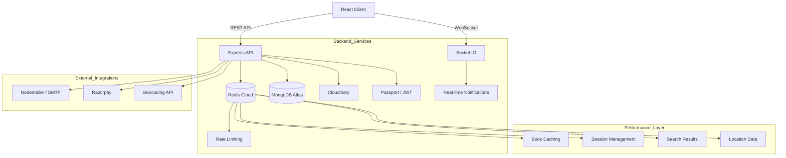

<div align="center">

#  BookHive  
### The Community-Driven Platform for Modern Readers

[**Live Application**](https://book-hive-frontend.onrender.com/) •
[**Report Bug**](https://github.com/abhijeetbhale/Book-Hive/issues) •
[**Request Feature**](https://github.com/abhijeetbhale/Book-Hive/issues)

[](LICENSE)
[](CONTRIBUTING.md)
[]()
[](https://redis.io/)
[](https://github.com/abhijeetbhale/Book-Hive/issues)
[](https://github.com/abhijeetbhale/Book-Hive/stargazers)

</div>

## 📖 About BookHive

**BookHive** is a full-stack, community-first web application designed to bridge the gap between digital book platforms and real-world literary communities.

While reading is often a solitary activity, the passion for books is inherently social. BookHive moves beyond the traditional “digital library” model by introducing a structured ecosystem where users can discover nearby books, manage borrowing workflows, attend literary events, and build trust through reputation-based engagement.

---

## 🎯 Core Vision

- **Social Interaction** — Transform reading from an isolated habit into a shared experience  
- **Access Over Ownership** — Promote a circular economy through local book borrowing  
- **Local Connectivity** — Use interactive maps to connect nearby readers  
- **Trust & Reputation** — Enable safe, transparent interactions through reviews and ratings
- **Performance First** — Enterprise-grade caching and optimization for seamless user experience  

---

## 🏗️ Architecture & Workflow

### 1. Borrowing Lifecycle

The following flow illustrates the end-to-end borrowing experience:



## 🚀 Key Features

### 🗺️ Discovery & Community
- **Hyper-local Discovery**: Interactive maps for finding nearby books and events
- **Literary Events**: Book clubs, author meetups, book fairs with organizer dashboards
- **Smart Search**: AI-powered book recommendations and filtering

### 💬 Communication & Trust
- **Real-time Messaging**: Encrypted chat with emojis, file sharing, and typing indicators
- **Smart Notifications**: iOS-style notifications with real-time updates
- **Reputation System**: Progressive star ratings and trust-based interactions

### ⚡ Performance & Scalability
- **Redis Caching**: 80-90% faster response times for popular content
- **Rate Limiting**: Redis-backed API protection and abuse prevention
- **Optimized Queries**: Indexed MongoDB operations (30-50% faster reads)
- **Real-time Updates**: WebSocket connections for instant notifications

### 🔒 Security & Reliability
- **Role-Based Access Control**: Granular permissions for users, organizers, moderators, and admins
- **API Documentation**: Interactive Swagger/OpenAPI documentation at `/api-docs`
- **Background Jobs**: Asynchronous email processing, image optimization, and cleanup tasks
- **Comprehensive Testing**: Unit and integration tests with 80%+ code coverage
- **Input Validation**: XSS protection, SQL injection prevention, and data sanitization
- **Rate Limiting**: Redis-backed protection against API abuse and DDoS attacks
- **JWT Authentication**: Secure token-based authentication
- **Input Validation**: Comprehensive data sanitization
- **Error Handling**: Graceful fallbacks and monitoring
- **Production Ready**: Health checks and monitoring endpoints

## 🏆 Reputation & Trust Model

BookHive uses a gamified reputation system to encourage positive community engagement:

| Tier | Reviews Required | Rating | Badge |
|------|------------------|--------|-------|
| Novice | 0–9 | — | 🥚 |
| Apprentice | 10–19 | ⭐ | 🌱 |
| Reader | 20–29 | ⭐⭐ | 📚 |
| Scholar | 30–39 | ⭐⭐⭐ | 🎓 |
| Librarian | 40–49 | ⭐⭐⭐⭐ | 🏛️ |
| Guardian | 50+ | ⭐⭐⭐⭐⭐ | 🛡️ |

---

## ⚡ Performance & Caching

BookHive leverages **Redis Cloud** for enterprise-grade performance:

### 🚀 Performance Improvements
- **80-90% faster** repeated searches and popular content
- **Sub-second response times** for cached book listings
- **Real-time user tracking** with online status management
- **Intelligent cache invalidation** for data consistency

### 📊 Caching Strategy
- **Popular Books**: 24-hour TTL for trending content
- **Search Results**: 1-hour TTL for query optimization
- **User Sessions**: 7-day TTL for authentication
- **Geospatial Data**: 30-minute TTL for location-based features

### 🛡️ Rate Limiting
- **Search Endpoints**: 100 requests/hour
- **Authentication**: 5 attempts/15 minutes
- **File Uploads**: 10 uploads/hour
- **General API**: 1000 requests/hour

### 🔍 Monitoring
- Cache hit/miss ratios logged in real-time
- Health check endpoints for system monitoring
- Graceful fallback to MongoDB when Redis is unavailable


## 🛠 Technology Stack

| Layer     | Technologies |
|-----------|--------------|
| **Frontend** | React 18, React Router, Tailwind CSS, Framer Motion, Leaflet, React-Leaflet, Axios, Styled Components |
| **Backend**  | Node.js, Express.js, MongoDB, Mongoose, Socket.IO, Passport.js, JWT |
| **Caching & Performance** | **Redis Cloud**, Rate Limiting, Connection Pooling |
| **Background Jobs** | **BullMQ**, Job Queues, Email Processing, Image Optimization |
| **API Documentation** | **Swagger/OpenAPI 3.0**, Interactive API Explorer |
| **Access Control** | **Role-Based Access Control (RBAC)**, Permission Management |
| **Testing** | **Jest**, Supertest, MongoDB Memory Server, Unit & Integration Tests |
| **Real-time** | Socket.IO, WebSocket, Live Notifications |
| **Payments** | Razorpay Integration |
| **Media & Storage** | Cloudinary (Images), File Upload |
| **Email & Communication** | Nodemailer, SMTP |
| **Security** | Helmet, HPP, XSS Protection, Input Validation |
| **Monitoring** | Health Checks, Error Logging, Performance Metrics |
| **Jobs & Scheduling** | Node-Cron, Automated Tasks |


## ⚙️ Installation & Setup

### 1. Prerequisites
- Node.js (v16+)
- MongoDB (Local or Atlas)
- Redis Cloud Account (for caching)
- Cloudinary Account

### 2. Clone Repository
```bash
git clone https://github.com/abhijeetbhale/Book-Hive.git
cd Book-Hive
```

### 3. Backend Configuration
Create a `.env` file inside `/server` using the template:

```bash
cp server/.env.example server/.env
```

Then configure your environment variables:

```bash
# Server Configuration
PORT=5000
NODE_ENV=development
CLIENT_URL=http://localhost:3000

# MongoDB Connection
MONGODB_URI=your_mongodb_connection_string

# Redis Configuration (Redis Cloud)
REDIS_URL=redis://default:<password>@<host>:<port>
REDIS_TTL_DEFAULT=3600
REDIS_TTL_SESSION=604800
REDIS_TTL_SEARCH=3600
REDIS_TTL_GEO=1800

# JWT Authentication
JWT_SECRET=your_jwt_secret_key
JWT_EXPIRES_IN=7d

# Cloudinary Configuration
CLOUDINARY_CLOUD_NAME=your_cloud_name
CLOUDINARY_API_KEY=your_api_key
CLOUDINARY_API_SECRET=your_api_secret

# Email Configuration
EMAIL_HOST=smtp.gmail.com
EMAIL_PORT=587
EMAIL_USER=your_email
EMAIL_PASS=your_app_password
EMAIL_FROM="BookHive" <your_email>

# Google OAuth (Optional)
GOOGLE_CLIENT_ID=your_google_client_id
GOOGLE_CLIENT_SECRET=your_google_client_secret

# Admin Configuration
SUPER_ADMIN_EMAIL=your_admin_email

# Razorpay Payment Gateway
RAZORPAY_KEY_ID=your_razorpay_key_id
RAZORPAY_KEY_SECRET=your_razorpay_key_secret

# API Documentation
SWAGGER_ENABLED=true
API_DOCS_PATH=/api-docs

# Background Jobs (BullMQ)
BULL_BOARD_USERNAME=admin
BULL_BOARD_PASSWORD=secure_admin_password

# Testing Configuration (Optional)
MONGODB_URI_TEST=mongodb://localhost:27017/bookhive_test
JWT_SECRET_TEST=test_jwt_secret_for_testing_only
REDIS_URL_TEST=redis://localhost:6379/1
```

Install dependencies and start the server:
```bash
cd server
npm install
npm run dev
```

### 4. Frontend Configuration
Create a `.env` file inside `/client`:

```bash
REACT_APP_API_URL=http://localhost:5000/api
REACT_APP_SOCKET_URL=http://localhost:5000
REACT_APP_RAZORPAY_KEY=your_razorpay_key_id
```

Install dependencies and start the client:
```bash
cd client
npm install
npm start
```

### 5. Verify Installation
- **Backend**: http://localhost:5000/api/health
- **Frontend**: http://localhost:3000
- **API Documentation**: http://localhost:5000/api-docs
- **Redis Health**: http://localhost:5000/api/books-cached/cache/health
- **Job Queue Status**: http://localhost:5000/api/jobs/status

---

## 🔧 Development Tools

### API Documentation
- **Interactive Swagger UI**: http://localhost:5000/api-docs
- **OpenAPI Specification**: Complete API documentation with examples
- **Try It Out**: Test endpoints directly from the browser

### Background Jobs & Queues
```bash
# Start job processor
npm run jobs:start

# Development mode with auto-restart
npm run jobs:dev

# Check queue status
curl http://localhost:5000/api/jobs/status
```

### Testing Suite
```bash
# Run all tests
npm test

# Unit tests only
npm run test:unit

# Integration tests only
npm run test:integration

# Test coverage report
npm run test:coverage
```

### RBAC Management
```bash
# Initialize roles and migrate users
npm run migrate:rbac

# Test admin endpoints
npm run test:admin
```

### Cache Management
```bash
# Test Redis connection
npm run test:redis

# Warm cache with data
npm run cache:warm

# Clear all caches
npm run cache:flush
```

### Health Monitoring
- **Server Health**: `GET /api/health`
- **Cache Health**: `GET /api/books-cached/cache/health`
- **Database Status**: Included in health endpoints

---

## 🌟 What's New

### Latest Updates (v2.0)
- ✅ **Redis Cloud Integration**: Enterprise-grade caching for 80-90% performance improvement
- ✅ **Advanced Rate Limiting**: Redis-backed API protection
- ✅ **Real-time Caching**: Intelligent cache invalidation and warming
- ✅ **Enhanced Security**: Comprehensive input validation and error handling
- ✅ **Performance Monitoring**: Health checks and system metrics
- ✅ **Geospatial Caching**: Location-based book discovery optimization

### API Endpoints
- **Standard Books API**: `/api/books` (Direct database queries)
- **Cached Books API**: `/api/books-cached` (Redis-optimized responses)
- **Health Monitoring**: `/api/health` (System status)
- **Cache Management**: `/api/books-cached/cache/health` (Cache status)

---

## 🤝 Contributing

We welcome contributions! Please see our [Contributing Guidelines](CONTRIBUTING.md) for details.

### Development Workflow
1. Fork the repository
2. Create a feature branch (`git checkout -b feature/amazing-feature`)
3. Commit your changes (`git commit -m 'Add amazing feature'`)
4. Push to the branch (`git push origin feature/amazing-feature`)
5. Open a Pull Request

### Code Standards
- Follow ESLint configuration
- Write meaningful commit messages
- Add tests for new features
- Update documentation as needed
---
<div align="center">
  

## 📊 Repository Activity


---
</div>
<div align="center">
Built with ❤️ by Abhijeet Bhale

</div>
