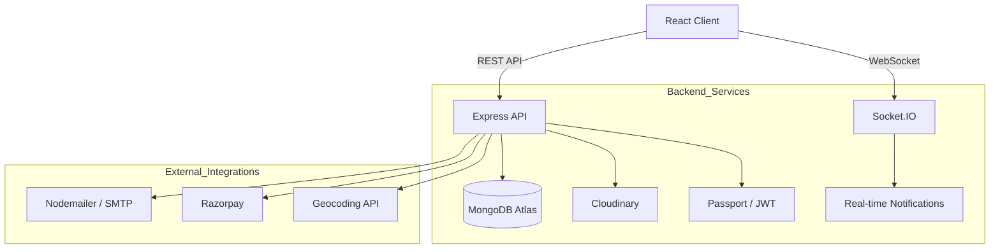

<div align="center">

# 🐝 BookHive  
### The Community-Driven Platform for Modern Readers

[**Live Application**](https://book-hive-frontend.onrender.com/) •
[**Report Bug**](https://github.com/abhijeetbhale/Book-Hive/issues) •
[**Request Feature**](https://github.com/abhijeetbhale/Book-Hive/issues)

[](LICENSE)
[](CONTRIBUTING.md)
[]()
[](https://github.com/abhijeetbhale/Book-Hive/issues)
[](https://github.com/abhijeetbhale/Book-Hive/stargazers)

</div>

## 📖 About BookHive

**BookHive** is a full-stack, community-first web application designed to bridge the gap between digital book platforms and real-world literary communities.

While reading is often a solitary activity, the passion for books is inherently social. BookHive moves beyond the traditional “digital library” model by introducing a structured ecosystem where users can discover nearby books, manage borrowing workflows, attend literary events, and build trust through reputation-based engagement.

---

## 🎯 Core Vision

- **Social Interaction** — Transform reading from an isolated habit into a shared experience  
- **Access Over Ownership** — Promote a circular economy through local book borrowing  
- **Local Connectivity** — Use interactive maps to connect nearby readers  
- **Trust & Reputation** — Enable safe, transparent interactions through reviews and ratings  

---

## 🏗️ Architecture & Workflow

### 1. Borrowing Lifecycle

The following flow illustrates the end-to-end borrowing experience:

```mermaid
graph LR
    A[User Discovers Book] -->|Request Sent| B[Pending Approval]
    B -->|Owner Approves| C[Chat Opened]
    C -->|Exchange Details| D[Book Handover]
    D -->|Status Update| E[Reading]
    E -->|Finished| F[Return Book]
    F -->|Both Users| G[Review & Reputation]

    style A fill:#e3f2fd,stroke:#1565c0,stroke-width:2px
    style G fill:#fffde7,stroke:#f9a825,stroke-width:2px,stroke-dasharray:5,5
```



## 🚀 Key Features

🗺️ Discovery & Community

- Hyper-local book and event discovery via interactive maps
- Literary events: book clubs, author meetups, book fairs
- Organizer roles with dedicated management dashboards

## 💬 Communication & Trust

- Real-time encrypted messaging with emojis and file sharing
- iOS-style smart notifications
- Reputation system with progressive star ratings

## ⚡ Performance & SEO

- Indexed MongoDB queries (30–50% faster reads)
- Dynamic SEO with meta tags and structured data
- Optimistic UI updates for sub-500ms feedback

## 🏆 Reputation & Trust Model

BookHive uses a gamified reputation system to encourage positive community engagement:

Tier	Reviews Required	Rating	Badge
- Novice	0–9	—	🥚
- Apprentice	10–19	⭐	🌱
- Reader	20–29	⭐⭐	📚
- Scholar	30–39	⭐⭐⭐	🎓
- Librarian	40–49	⭐⭐⭐⭐	🏛️
- Guardian	50+	⭐⭐⭐⭐⭐	🛡️


## 🛠 Technology Stack

| Layer     | Technologies |
|-----------|--------------|
| **Frontend** | React 18, React Router, Tailwind CSS, Framer Motion, Leaflet, React-Leaflet, Axios |
| **Backend**  | Node.js, Express.js, MongoDB, Mongoose, Socket.IO, Passport.js, JWT |
| **Payments** | Razorpay |
| **Media**    | Cloudinary |
| **Email**    | Nodemailer |
| **Jobs / Scheduling** | Node-Cron |


## ⚙️ Installation & Setup
 1. Prerequisites:
- Node.js (v16+)
- MongoDB (Local or Atlas)
- Cloudinary Account

 2. Clone Repository:

```bash
git clone https://github.com/abhijeetbhale/Book-Hive.git
cd Book-Hive
```

 3. Backend Configuration
Create a .env file inside /server:

```bash
PORT=5000
MONGO_URI=your_mongodb_connection_string
JWT_SECRET=your_jwt_secret
CLIENT_URL=http://localhost:3000
CLOUDINARY_CLOUD_NAME=your_cloud_name
CLOUDINARY_API_KEY=your_api_key
CLOUDINARY_API_SECRET=your_api_secret
SMTP_HOST=smtp.gmail.com
SMTP_USER=your_email
SMTP_PASS=your_app_password
RAZORPAY_KEY_ID=your_id
RAZORPAY_KEY_SECRET=your_secret
```

```bash
cd server
npm install
npm start
```
 4. Frontend Configuration
Create a .env file inside /client:

```bash
REACT_APP_API_URL=http://localhost:5000/api
REACT_APP_SOCKET_URL=http://localhost:5000
REACT_APP_RAZORPAY_KEY=your_razorpay_key_id
Run frontend:
```

```bash
cd client
npm install
npm start
```
---
<div align="center">
  

## 📊 Repository Activity


---
</div>
<div align="center">
Built with ❤️ by Abhijeet Bhale

</div>
